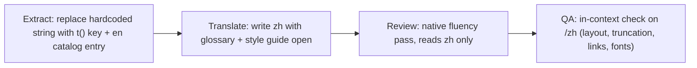

# Internationalization (i18n) — Architecture & Handbook

This document defines how Cosmic Signature is a multilingual site. It shipped
**Simplified Chinese (`zh`)** first, **Ukrainian (`uk`)** second, and then the two
**Traditional Chinese variants (`zh-TW`, `zh-HK`)**; every later language follows the
checklist in §10. It covers the technical architecture, the message/content structure, the
translation workflow, and the quality bar. It is written so that any engineer or translator
can pick up a unit from a progress tracker and know exactly what to do.

**The document set:**

| Document                                       | Purpose                                                                        |
| ---------------------------------------------- | ------------------------------------------------------------------------------ |
| [README.md](./README.md) (this file)           | Architecture, tooling, workflow, definition of done                            |
| [glossary-zh.md](./glossary-zh.md)             | Canonical Simplified Chinese translation for every protocol term + banned list |
| [style-guide-zh.md](./style-guide-zh.md)       | Rules for making the Simplified Chinese sound native, not translated           |
| [progress.md](./progress.md)                   | Simplified Chinese rollout: site inventory, sprint plan, progress tracker      |
| [glossary-zh-TW.md](./glossary-zh-TW.md)       | Taiwan Traditional Chinese terms, Taiwan vocabulary, banned register           |
| [style-guide-zh-TW.md](./style-guide-zh-TW.md) | What differs for Taiwan: vocabulary, characters (裡/著/台), 「」, review hunts |
| [progress-zh-TW.md](./progress-zh-TW.md)       | Taiwan rollout: per-namespace and per-area T/R/Q tracker                       |
| [glossary-zh-HK.md](./glossary-zh-HK.md)       | Hong Kong Traditional Chinese terms, Hong Kong vocabulary, banned register     |
| [style-guide-zh-HK.md](./style-guide-zh-HK.md) | What differs for Hong Kong: written Chinese, 裏/着, standard Big5 forms, 「」  |
| [progress-zh-HK.md](./progress-zh-HK.md)       | Hong Kong rollout: per-namespace and per-area T/R/Q tracker                    |
| [glossary-uk.md](./glossary-uk.md)             | Canonical Ukrainian translation for every protocol term + banned-term list     |
| [style-guide-uk.md](./style-guide-uk.md)       | Rules for making the Ukrainian sound native (cases, four plural forms)         |
| [progress-uk.md](./progress-uk.md)             | Ukrainian rollout: per-namespace and per-area T/R/Q tracker                    |

> Note: `docs/` is intentionally outside the lexicon scanner's `SCAN_DIRS`
> (see `scripts/lexicon-scan.ts`), so these documents may cite banned vocabulary
> in order to define and forbid it.

---

## 1. Goals and decisions (locked)

- **Shipped languages:** Simplified Chinese, mainland conventions, also serving Singapore
  — locale code `zh` (hreflang alias `zh-Hans`); Taiwan Traditional Chinese — `zh-TW`
  (alias `zh-Hant`); Hong Kong Traditional Chinese — `zh-HK` (alias `zh-MO`, Macau
  follows Hong Kong conventions); Ukrainian — `uk`.
- **Locale codes are canonical BCP 47 tags, chosen to match what browsers send.** A bare
  language code is the CLDR default variant of that language (`zh` = Simplified,
  mainland); further variants of the same language carry the region that distinguishes
  them (`zh-TW`, `zh-HK`). This keeps `Intl`, RainbowKit, hreflang, and `<html lang>`
  free of translation tables, and next-intl's CLDR "best fit" negotiation resolves
  `Accept-Language: zh-Hant` to `zh-TW` and `zh-MO` / `yue` to `zh-HK` without code.
  `LOCALE_ALIASES` in `i18n/routing.ts` lists the extra tags each locale serves; they
  become additional hreflang alternates and are honoured by `normalizeLocale`.
- **Variants are separate locales, not conversions.** `zh-TW` and `zh-HK` have their own
  catalogs, copy modules, glossaries, banned registers, terminology packs, fonts, and e2e
  fixtures. `npm run i18n:derive` bootstraps a draft from a sibling script; the copy stage
  rewrites it (§10).
- **URL strategy:** locale-prefixed paths with `localePrefix: 'as-needed'`.
  English keeps every existing URL unchanged (`/gallery`); every other locale lives
  under its prefix (`/zh/gallery`, `/zh-TW/gallery`, `/uk/gallery`). Prefixes are matched
  case-insensitively and longest-first (`/zh-tw/…` redirects to `/zh-TW/…`; `/zh-TW`
  is never read as `/zh` + `-TW`). This applies on **both hosts**:
  - `cosmicsignature.com/zh`, `cosmicsignature.com/zh-TW`, `cosmicsignature.com/uk` — landing
  - `app.cosmicsignature.com/zh/gallery`, `app.cosmicsignature.com/zh-HK/gallery` — dApp
- **Everything is translated.** Every page, tooltip, toast, error, empty state, `aria-label`,
  SEO title/description, OG image text, and JSON-LD. No surface is exempt (admin/internal
  tools are translated last, but they are translated).
- **Quality bar:** every locale must read as if originally written in that language
  (see [style-guide-zh.md](./style-guide-zh.md), [style-guide-uk.md](./style-guide-uk.md)).
  Literal translation is a defect.
- **Future languages** (ja, ...) are added by: extending `locales`, filling the
  `LocaleRecord` registries the compiler then lists, adding a `messages/<locale>/`
  directory and per-locale content modules, a lexicon profile and terminology pack, an
  e2e chrome fixture, and a glossary + style guide (§10). No further architectural change.
  A further variant of an existing language (`pt-BR` beside `pt`, say) follows the same
  path plus `LOCALE_ALIASES` and, for a second script, an entry in `SCRIPT_CONVENTIONS`.

## 2. Library and routing architecture

**Library: [`next-intl`](https://next-intl.dev)** — the de-facto standard for the App Router.
Reasons: native Server Components support (zero client JS for server-rendered strings),
Next.js 16 compatibility, ICU MessageFormat, typed message keys, built-in locale-aware
navigation APIs, and static rendering support via `setRequestLocale`.

### 2.1 Route restructure

All routes move under a top-level dynamic segment. Route groups are preserved:

```
app/
  [locale]/
    (app)/        ← everything currently in app/(app)/
      layout.tsx
      page.tsx
      gallery/page.tsx
      ...
    (landing)/    ← everything currently in app/(landing)/
      layout.tsx
      landing-site/page.tsx
      ...
  api/            ← API routes stay outside [locale]
```

New i18n plumbing:

```
i18n/
  routing.ts      ← defineRouting({ locales: ['en', 'zh', 'zh-TW', 'zh-HK', 'uk'], … }), LOCALE_LABELS, LOCALE_ALIASES
  locale.ts       ← AppLocale, LocaleRecord<T>, normalizeLocale, pickByLocale (the only locale parser)
  localeConfig.ts ← per-locale rendering conventions: Intl tag, og:locale, JSON-LD inLanguage,
                    word spacing, week start, ellipsis, provider-error policy
  request.ts      ← getRequestConfig: loads + merges messages for the request locale
  navigation.ts   ← createNavigation(routing): locale-aware Link, useRouter, usePathname, redirect
lib/
  hreflang.ts     ← languageAlternates(): every locale, its aliases, x-default (metadata + sitemaps)
messages/
  en/*.json       ← English catalogs (source of truth), one file per namespace
  zh/*.json       ← Simplified Chinese catalogs (same keys, same shape)
  zh-TW/*.json    ← Taiwan Traditional Chinese catalogs
  zh-HK/*.json    ← Hong Kong Traditional Chinese catalogs
  uk/*.json       ← Ukrainian catalogs
```

`normalizeLocale` resolves locale-ish input in four steps: exact code (any casing, `_`
separators) → `LOCALE_ALIASES` → best variant of the same language by
`Intl.Locale#maximize()` (script before region: `zh-SG` → `zh`, `zh-Hant-MO` → `zh-HK`)
→ default locale. It never crosses languages; visitor negotiation is next-intl's job.

**No `locale === 'zh'` ternaries anywhere.** Every per-locale value lives in a
`LocaleRecord<T>` — either in `i18n/localeConfig.ts` (cross-cutting conventions), in a
registry next to its single consumer (e.g. the RainbowKit locale map in
`components/wallet/WalletUi.tsx`), or in a content/copy registry (§3.2). `Record<AppLocale, T>`
means adding a locale to `routing.locales` turns every registry into a compile error until
an entry exists.

`next.config.ts` gets wrapped with `createNextIntlPlugin()` (composes with the existing
Sentry and bundle-analyzer wrappers).

**Every layout and page** under `[locale]` must:

1. `generateStaticParams()` returning `routing.locales.map((locale) => ({ locale }))`
   (root layouts only), and
2. call `setRequestLocale(locale)` before using any next-intl API — this keeps static
   rendering / CDN caching intact, which the current architecture depends on
   (see the comment in `app/root-document.tsx`).

The locale layout validates the param and provides messages:

```tsx
// app/[locale]/(app)/layout.tsx (same pattern for (landing))
const { locale } = await params;
if (!hasLocale(routing.locales, locale)) notFound();
setRequestLocale(locale);
// <NextIntlClientProvider> wraps providers so client components can translate
```

### 2.2 Navigation codemod

All imports of `next/link`'s `Link` and of `useRouter` / `usePathname` / `redirect` from
`next/navigation` are replaced by the wrappers exported from `i18n/navigation.ts`.
This is what keeps a user on `/zh/...` when they click any internal link. Cross-host links
(`APP_ORIGIN`/`LANDING_ORIGIN` absolute URLs in nav, footer, landing CTAs) must have the
locale prefix appended explicitly — add a helper `localeHref(origin, path, locale)` in
`lib/hostRouting.ts`.

### 2.3 Composing with the host-routing middleware (`proxy.ts`)

The edge middleware currently does host separation (landing vs app) and the
`/` → `/landing-site` rewrite. It gains a locale-awareness layer, in this order:

1. **Split the locale prefix** off the incoming pathname:
   `/zh/gallery` → `{ locale: 'zh', publicPath: '/gallery' }`; `/gallery` → `{ locale: undefined, publicPath: '/gallery' }`.
2. **Run all host checks against `publicPath`** — `isAppOnlyPath`, `isLandingOnlyPath`,
   and the landing root check. Redirect targets re-attach the prefix:
   `${LANDING_ORIGIN}${localePrefix}${publicPath}`.
3. **Landing root rewrite becomes locale-aware:** `/` → `/landing-site`, `/zh` → `/zh/landing-site`.
4. **Delegate to the next-intl middleware** (`createMiddleware(routing)`) instead of
   returning `NextResponse.next()`. It resolves the locale (URL prefix → `NEXT_LOCALE`
   cookie → `Accept-Language` → default), rewrites internally to `/[locale]/...`, and
   manages the cookie.

The middleware `matcher` keeps its current asset exclusions. E2E host-routing specs are
extended with `/zh` variants of every existing case.

### 2.4 Language switcher

A small globe dropdown — one option per entry in `routing.locales`, labeled from
`LOCALE_LABELS` (`English` / `中文` / `Українська`) — rendered in:

- the dApp header (`components/layout/`), desktop + mobile drawer,
- the landing header and both footers.

Behavior: switching calls `router.replace(pathname, { locale })` from `i18n/navigation.ts`
(preserves the current route and params), and next-intl persists the choice in the
`NEXT_LOCALE` cookie so subsequent visits to unprefixed URLs redirect to the preferred
locale. The switcher itself is labeled in the _target_ language (the Chinese option always
reads 中文, the English option always reads English) — never translate language names.

## 3. Where strings live

Two tiers, chosen by shape of the content:

### 3.1 Message catalogs (`messages/<locale>/*.json`) — UI strings

All interface strings: labels, buttons, table headers, tooltips, toasts, errors, empty
states, aria-labels, form validation, and per-page SEO title/description. One JSON file
per namespace, identical key structure across locales:

```
common.json     nav.json        footer.json     wallet.json
home.json       landing.json    currentCycle.json  gallery.json  detail.json
gesture.json    anchoring.json  allocation.json myPages.json
statistics.json tables.json     tooltips.json   toasts.json
errors.json     forms.json      meta.json       seo.json
siteMap.json    contracts.json  admin.json      formats.json    …
```

The authoritative list is `NAMESPACES` in `i18n/request.ts` (35 namespaces); `how-it-works`
is a content module (§3.2), not a catalog.

Usage: `useTranslations('gallery')` in client components, `getTranslations` in server
components and `generateMetadata`.

**Key conventions:**

- Keys describe _role_, not content: `hero.headline`, not `everyGestureShapes`.
- Never concatenate translated fragments; use ICU placeholders: `"gestureCost": "Gesture Cost: {amount} ETH"`.
- ICU `plural` blocks carry every category the locale's `Intl.PluralRules` defines:
  `one/other` in `en`; a single `other` in `zh`, which has no plural inflection (style
  guide §7); `one/few/many/other` in `uk` (style-guide-uk). `npm run i18n:strict` fails on
  a missing category.
- Embedded markup uses `t.rich` with named tags, never raw HTML in messages.
- A string used on 2+ pages goes in `common`/`tables`/`tooltips`, not duplicated.

**Seeding:** `content/dapp.ts` was written as a dApp copy catalog but is not consumed by
production code. Sprint 0 converts it into the initial `messages/en/*.json` files, then
**deletes it** so there is exactly one source of truth. `content/statistics-copy.ts`
migrates into `statistics.json`/`tables.json`/`tooltips.json` during Sprint 5.

### 3.2 Per-locale content modules — structure/text split

500-line articles don't belong in JSON. Long-form copy stays in typed TypeScript, but the
locale-independent **structure** (ids, icons, hrefs, hash anchors, tones, option ids,
correct answers, section trees, `protocolFacts` wiring) is written **once** and only the
translated **text** is per-locale:

```
content/
  faq/         types.ts  structure.ts  text.en.ts  text.zh.ts  index.ts  ← getFaqContent(locale)
  quiz/        (same pattern, per tier)
  white-paper/ (same pattern)
  landing/     (same pattern)
  learn/       (same pattern)
  how-it-works/(same pattern)
  about/       types.ts  en.ts  zh.ts  index.ts   ← small enough that types.ts already holds structure
  protocol-facts.ts                               ← numbers, locale-independent (unchanged)
```

`structure.ts` declares the skeleton `as const`; text modules are typed by mapped types
over the skeleton's literal ids, so a missing or invented translation id **fails to
compile**. `index.ts` composes skeleton + text into the public content shape (exports are
unchanged) and resolves the locale through a `LocaleRecord` registry — see
`content/faq/` for the reference implementation.

Legal and trust pages (Terms, Privacy, Risk Disclosures, Security, Audits) share one
renderer each (`TermsContent.tsx`, `PrivacyContent.tsx`, `TrustPageContent.tsx`) plus
per-locale copy objects (`*.en.ts` / `*.zh.ts`), resolved via `content/legal/index.ts`.
No JSX is duplicated per locale.

**Fallback policy:** `i18n/request.ts` deep-merges each translated locale's messages over
the `en` catalog, so a missing key renders English — never a raw key path. Long-form content has **no
runtime fallback**: the text-module types make partial translations a compile error, so a
locale ships complete or not at all.

## 4. Locale-aware formatting

Formatting conventions live in two places: `i18n/localeConfig.ts` for non-text conventions
(Intl tag, week start, word spacing, ellipsis, provider-error policy) and
`LocaleRecord`-typed format registries in `utils/format.ts` / `utils/time.ts` for
per-locale date/duration templates (compact duration units come from the
`formats.durationCompact` message catalog, the single source shared with
`useTranslations('formats')` consumers). The table below records the original migration:

| Today                                                            | Change                                                                                 |
| ---------------------------------------------------------------- | -------------------------------------------------------------------------------------- |
| `Intl.NumberFormat('en-US')` in `utils/format.ts`, SEO summaries | Take a `locale` argument; use next-intl `useFormatter`/`getFormatter` where convenient |
| `convertTimestampToDateTime` with hardcoded `Jan…Dec`            | `Intl.DateTimeFormat(locale, …)`; zh renders `1月1日 12:34`                            |
| `formatYyyymmddLabel`, `formatUnixTsLabel` month arrays          | Same — `Intl.DateTimeFormat(locale, { month: 'short' })`                               |
| `formatSeconds` → `1d 2h 30m 45s`                                | Locale unit map; zh: `3天5小时12分45秒` (compact contexts), see style guide §5         |
| `formatEthValue`/`formatCSTValue` unit suffixes                  | Units stay `ETH`/`CST` in all locales (glossary: keep-in-English)                      |
| `components/ui/date-picker.tsx` weekday labels `Su…Sa`           | zh: `日 一 二 三 四 五 六`; week starts Monday for zh                                  |
| `react-countdown` renderers                                      | Localized unit labels via `formats.json`                                               |

English output must remain byte-identical — every formatting change is guarded by
existing unit tests plus new zh cases.

## 5. Fonts

Clash Display (display headings) and Inter (body) contain **no CJK glyphs**. Without
action, Chinese renders in unstyled system fallback.

- Add **Noto Sans SC** via `next/font/google` (one variable-weight set,
  `--font-noto-sc`, `display: 'optional'`). Google Fonts serves it as ~100 small
  `unicode-range` slices, so browsers only download the glyph ranges a page actually uses —
  English pages fetch nothing. `optional` prevents a late CJK metric swap on slow links;
  the approved system CJK stack remains visible when Noto misses the short load window.
  Noto is appended to the global font stacks unconditionally (after Inter / after Clash
  Display).
- Chinese headings render in the locale's Noto Sans cut via fallback (Clash Display has
  no CJK). An `html:lang(zh)` rule — matching `zh`, `zh-TW`, and `zh-HK` alike — bumps
  display-heading weight to 700 and tightens letter-spacing to `0` (CJK must never be
  letter-spaced like the Latin display face).
- System fallback chain after Noto: `"PingFang SC", "Microsoft YaHei", sans-serif`.
- **Three cuts, one property.** Noto Sans SC, TC, and HK share a design but differ in
  glyph forms (mainland, Taiwan MOE, and Hong Kong 常用字字形表 standards); a Hong Kong
  reader shown TC forms sees text that is legible but subtly wrong. Every font-family that
  may render Chinese references `--cjk-font-stack` (body, display, mono); `:root` sets the
  SC stack and `html:lang(zh-TW)` / `html:lang(zh-HK)` swap in `--font-noto-tc` +
  `PingFang TC` / `--font-noto-hk` + `PingFang HK` (`lib/fonts.ts`, same loading policy).
  OG images embed the matching weight-700 subset, regenerated by `npm run og:fonts`
  (`scripts/build-og-fonts.ts`) from the copy in each locale's `seo.json`; the OG tests
  fail when a subset no longer covers its copy.
- `RootDocument` receives `locale` and sets `<html lang={locale}>` and `<html dir>` (from
  `LocaleConfig.textDirection`) — this is also what activates the CSS overrides and
  correct line-breaking behavior.

**Cyrillic (Ukrainian).** Inter's build-time CSS already declares the `cyrillic` and
`cyrillic-ext` `unicode-range` slices, so body text needs nothing extra and those slices
are fetched on demand only (never preloaded — English pages must not pay for them).
Clash Display, however, has no Cyrillic glyphs, so `/uk` headings switch to **Onest**
(`next/font/google`, `--font-onest`, `preload: false`, `display: 'optional'` — the same
policy as Noto Sans SC). The display stack is indirected through the
`--display-font-stack` custom property in `styles/global.css`: `html[lang='uk']` replaces
the whole stack rather than appending Onest after Clash, so Latin letters inside a
Ukrainian heading (ETH, CST, brand names) do not render in a different face with a
different x-height. OG images for `/uk` load the checked-in `assets/fonts/Onest-700.subset.ttf`
(Latin + Cyrillic, OFL) through `lib/og/fonts.ts`.

## 6. SEO, metadata, and structured data

- **`utils/seo.ts` → `createMetadata`** gains a `locale` + `path` requirement and emits:
  - `alternates.canonical` — locale-correct (`/zh/faq` canonicalizes to `/zh/faq`),
  - `alternates.languages` — hreflang map: `en` → unprefixed URL, `zh` → `/zh` URL,
    `x-default` → English,
  - `openGraph.locale` — `en_US` / `zh_CN` / `uk_UA` from `LocaleConfig.ogLocale` (also fix
    the hardcoded value in `app/root-metadata.ts` and the landing layout).
- **Page metadata** moves from inline strings into the `meta` namespace; `generateMetadata`
  reads `params.locale` and calls `getTranslations`. (~59 pages, tracked per-route in
  progress.md.)
- **`app/sitemap.ts` / `lib/seoRoutes.ts`**: every URL entry gains `alternates.languages`.
- **JSON-LD** (`utils/jsonLd.ts`): translated `name`/`description`, `inLanguage: 'zh-Hans'`
  on zh pages; FAQ JSON-LD uses the zh FAQ content.
- **OG images** (`opengraph-image.tsx` files): `ImageResponse` needs an explicit CJK font
  buffer (subset Noto Sans SC TTF in `assets/`) — Latin-only fonts render tofu. Scheduled
  as its own Sprint 7 item.
- **`public/llms.txt`**: add a Chinese section at the end of the rollout.

## 7. Guardrails (CI)

1. **Catalog integrity — `scripts/i18n-parity.ts` / `scripts/i18n-parity-core.ts`**:
   for every locale in `routing.locales` (the `messages/` tree must mirror it exactly),
   compares each namespace against `messages/en/**` and checks key parity, ICU syntax
   (the same `@formatjs` parser next-intl uses), placeholder parity (same `{arguments}`,
   no invented `<tags>`), plural completeness against the locale's CLDR categories
   (`one/few/many/other` for uk, `other` for zh), and verbatim-copy catalogs. `npm run
i18n:parity` reports; `npm run i18n:strict` fails CI and pre-push (via `npm run
i18n:check`). The same checks run under jest in
   `i18n/__tests__/catalog-integrity.test.ts`.
2. **Lexicon scan**: `scripts/lexicon-scan-core.ts` declares one `LexiconProfile` per
   translated locale (`LEXICON_PROFILES`, typed against `TranslatedLocale`): the Chinese
   lists are matched as CJK substrings, the uk list as Unicode-bounded word forms plus
   word-initial stems (`\b` is ASCII-only, so Cyrillic needs `\p{L}` boundaries — see
   `scripts/locale-text-matchers.ts`). The Traditional locales share `ZH_HANT_BANNED_TERMS`
   and add regional registers (`ZH_TW_BANNED_TERMS`: 博弈, 競標, 報酬…; `ZH_HK_BANNED_TERMS`:
   六合彩, 派彩, 回報…). A profile runs on every locale-agnostic file and on every file of
   another language, but not on a sibling variant of its own language: the variants share
   characters while their registers differ (Hong Kong bans 回報 "return"; Taiwan writes
   回報問題 "report an issue"). File ownership is resolved by `scripts/locale-files.ts`,
   shared by all three CLIs. Same allow-pragma mechanism for FAQ/legal denial copy; JSON
   catalogs, which cannot carry pragmas, use `\uXXXX` escapes for denial copy.
3. **Terminology gate**: `scripts/terminology-consistency.ts` iterates
   `TRANSLATED_LOCALES`, scanning `messages/<locale>/**` and `content/**/*.<locale>.ts`
   with the locale's rule pack from `scripts/terminology/<locale>.ts` (drift variants for
   inflected languages are stems). The `zh-TW` and `zh-HK` packs also catch cross-variant
   vocabulary (網絡 in Taiwan copy, 網路 in Hong Kong copy, 使用者 vs 用戶), which is what
   makes a Traditional site read as "converted" to a native reader.
4. **Script conventions** — `scripts/i18n-script-conventions.ts` (`npm run
i18n:conventions`, part of `i18n:check`; jest twin `i18n/__tests__/script-conventions.test.ts`):
   one `SCRIPT_CONVENTIONS` entry per translated locale (`null` for single-script
   languages). Every catalog value and copy module of a Chinese locale must be a fixed
   point of its own OpenCC rendering (no Simplified character in Traditional copy and vice
   versa, phrase-aware, with a short allowlist of genuinely shared characters such as
   台/里/干/准), must use its regional character choices (Taiwan 裡/著/台, Hong Kong 裏/着
   and the standard Big5 code points rather than OpenCC's glyph variants 説/閲/户/税), and
   must use its quotation marks (「」『』 in Traditional copy, “” in Simplified).
5. **E2E**: `e2e/locale-fixtures.ts` holds locale lists and per-locale chrome strings;
   `e2e/locale-smoke.ts` and `e2e/locale-site-qa.ts` are locale-parametrized runners that
   a three-line `<locale>-smoke.spec.ts` / `<locale>-site-qa.desktop.spec.ts` plugs into
   (the Traditional runners also assert the TC / HK Noto cut leads the CJK stack). Shared
   specs (`proxy`, `perf-guards`, `seo-raw-html`, `a11y`, `landing`) loop over the
   translated locales. The Chinese sprint suites (`zh-*.spec.ts`) stay as the historical
   acceptance record. `npm run test:e2e:locales` runs every locale suite.
6. **Unit**: tests derive expectations from `routing.locales` (`test-utils/i18n.ts`
   builds hreflang maps including aliases), so adding a locale never rewrites them;
   formatting tests pin per-locale outputs (`utils/__tests__/format-extra.test.ts`,
   `time.test.ts`).
7. **Numeric claims**: `content/__tests__/copy-numeric-claims.test.ts` checks every
   locale's catalogs and long-form modules, matching duration nouns per language.

## 8. Translation workflow (per string, per page)



**Stage definitions (these are the four columns in progress.md):**

- **E — Extracted.** No hardcoded user-facing string remains in the file(s); English
  catalog/content entry exists; English rendering unchanged (spot-check + tests).
- **T — Translated.** zh entry written following the glossary and style guide. Machine
  translation may _draft_, never ship: every string is rewritten by a human who reads the
  glossary first. Interpolations, units, and links verified.
- **R — Reviewed.** A native-fluency editor reads the Chinese **without looking at the
  English** and edits anything that sounds translated (style guide §8 checklist). Glossary
  deviations either fixed or promoted into a glossary change.
- **Q — QA'd.** The page is loaded under `/zh`: no overflow/truncation, correct fonts,
  correct punctuation width, tooltips open with translated content, toasts fire in
  Chinese, links keep the `/zh` prefix, numbers/dates localized, lexicon scan + parity
  green.

**Rules of engagement:**

- Extraction PRs and translation PRs are separate (extraction is mechanical and
  en-reviewable; translation review needs a Chinese reader).
- One glossary. If a translator wants a different term, they change
  [glossary-zh.md](./glossary-zh.md) in the same PR and update all prior uses (grep the
  catalogs) — no silent divergence.
- Commit prefix `i18n(zh): …`; progress.md is updated in the same PR that changes status.
- `protocol-facts.ts` numbers are never restated in prose — interpolate them, exactly as
  the English does.

## 9. Running it locally

```bash
npm run dev
# dApp:    http://localhost:3000/zh   http://localhost:3000/zh-TW   http://localhost:3000/zh-HK   http://localhost:3000/uk
# landing: http://cosmicsignature.local:3000/zh-TW   (see lib/hostRouting.ts for /etc/hosts setup)
npm run i18n:parity                    # per-locale report (translated %, identical-to-source, problems)
npm run i18n:check                     # i18n:strict + i18n:conventions + terminology:check + lexicon:scan (pre-push runs this)
npm run i18n:derive -- --from zh --to zh-TW   # bootstrap a sibling-script draft (never ships as-is)
npm run og:fonts                       # regenerate the CJK OG font subsets after changing Chinese og copy
npm run test:e2e:locales               # every locale's smoke/QA suites plus a11y, routing, landing, wallet
npm run white-paper:pdf                # regenerate the per-locale white-paper PDFs (pandoc + tectonic)
npm run build && npm run bundle:budget # production output and full app-home JS budget
```

To test locale detection: clear the `NEXT_LOCALE` cookie and set the browser's language to
`zh-CN` (or `zh-TW`, `zh-HK`, `uk-UA`) — visiting `/` should redirect to `/zh` (or `/zh-TW`,
`/zh-HK`, `/uk`). `zh-Hant` lands on `/zh-TW`, `zh-MO` on `/zh-HK`, `zh-SG` on `/zh`.

## 10. Adding the next language

The compiler drives the checklist. After step 1, `npm run type-check` lists every place
that needs a decision — there is no grep step. The Ukrainian rollout is the worked
example for a new language; the Taiwan and Hong Kong rollouts are the worked example for
a new variant of an existing language (same steps, plus §10.1).

1. **Add the locale to `locales` in [`i18n/routing.ts`](../../i18n/routing.ts).** Choose the
   canonical BCP 47 tag browsers send: the bare language code for the CLDR default
   variant, region-qualified codes for further variants. Every `LocaleRecord<T>` /
   `Record<TranslatedLocale, T>` in the codebase now fails to compile until it has an entry:
   - `LOCALE_LABELS` (routing.ts) — the language's own name for the switcher (for
     variants, in the variant's own script and region wording: 繁體中文（香港）).
   - `LOCALE_ALIASES` (routing.ts) — extra tags the locale serves (`zh-Hant`, `zh-MO`);
     they become hreflang alternates and `normalizeLocale` hits. Empty is fine.
   - `i18n/localeConfig.ts` — Intl tag, `og:locale`, JSON-LD `inLanguage`, text direction,
     word spacing, week start (check CLDR: Taiwan and Hong Kong start on Sunday, the
     mainland on Monday), ellipsis, mid-sentence lowercasing, provider-error policy.
   - Format registries in `utils/format.ts` / `utils/time.ts` — date and duration
     templates (prefer `Intl` over hand-kept month/unit arrays; see the `uk` entries).
   - Single-consumer registries: RainbowKit locale in `components/wallet/WalletUi.tsx`,
     OG typography in `lib/og/fonts.ts` (a font buffer if the script is not Latin), OG copy
     in `lib/og/copy.ts`, error catalogs in `app/global-error.tsx`, the white-paper PDF
     typography in `scripts/generate-white-paper-pdf.ts` (output paths derive from the
     locale), the `getTranslations` mock in `jest.setup.ts` resolves any locale.
   - Every `content/*/index.ts` text registry and `content/legal/index.ts` copy registry —
     add `text.<locale>.ts` / `*.<locale>.ts` modules; their mapped types reject missing
     or extra ids, so partial translations cannot ship.
   - `LEXICON_PROFILES` in `scripts/lexicon-scan-core.ts` (banned register + matcher for
     the script), `TERMINOLOGY_PACKS` in `scripts/terminology-consistency-core.ts` (drift
     rules in `scripts/terminology/<locale>.ts`), and `SCRIPT_CONVENTIONS` in
     `scripts/i18n-script-conventions-core.ts` (`null` unless the language has more than
     one script).
   - `LOCALE_CHROME`, `LOCALE_SEO`, and `LOCALE_ROUTE_TEXT` in `e2e/locale-fixtures.ts`,
     then a `<locale>-smoke.spec.ts` and `<locale>-site-qa.desktop.spec.ts` that call the
     shared runners with the locale's QA profile; add the suite to `test:e2e:locales` and
     the locale to the landing loop in `e2e/landing.spec.ts`.
2. `cp -r messages/en messages/<locale>` and translate. `npm run i18n:parity` reports
   progress (translated %, values identical to the source); `npm run i18n:strict` fails
   on parity, ICU syntax, placeholder drift, incomplete plural categories for the locale's
   `Intl.PluralRules`, and untranslated namespaces. Untranslated values fall back to
   English at runtime while in progress.
3. Write `glossary-<locale>.md` + `style-guide-<locale>.md` + `progress-<locale>.md`.
   Decide the coined terms first — every batch of copy depends on them.
4. Fonts: if the script is outside Latin coverage of Clash Display / Inter, add a companion
   face with the Noto Sans / Onest loading policy and an `html:lang()` override of the
   relevant stack property (§5); add its OG subset to `scripts/build-og-fonts.ts` and run
   `npm run og:fonts`, recording the license in `THIRD_PARTY_NOTICES.md`. hreflang maps,
   the sitemap, `<html lang/dir>`, and the language switcher derive from
   `routing.locales` automatically.
5. Add locale sections to `public/llms.txt` / `public/llms-full.txt` (the tests pin the
   canonical routes for every translated locale); regenerate the white-paper PDF.

### 10.1 Adding a variant of an existing language

A variant (another script or region of a language already shipped) is a full locale — its
own catalogs, copy, glossary, gates, fixtures — never a conversion layer at runtime. What
is different is how the copy starts and what the gates must additionally catch:

1. Register it with the region-qualified code and an alias list (`zh-HK`, `['zh-MO']`);
   pin negotiation in `i18n/__tests__/negotiation.test.ts` (which runs
   `scripts/i18n-negotiation-probe.ts`, next-intl's exact matcher call) and canonicalization
   in `i18n/__tests__/locale.test.ts` (`normalizeLocale`), then confirm by setting the
   browser language.
2. `npm run i18n:derive -- --from <sibling> --to <variant>` writes a mechanical draft:
   OpenCC conversion, the target's quotation marks, character-form normalization, and the
   glossary substitutions declared for the pair in `scripts/i18n-derive-variant-core.ts`.
   Extend that table as the glossary grows so the next derivation starts closer. Register
   the generated modules in `content/*/index.ts`.
3. Write the glossary as a **difference document** against the sibling: which coined terms
   diverge and why (錨定配發 vs 錨定派發), the everyday vocabulary that marks the variant
   (使用者 vs 用戶), the character choices (裡/裏), and the banned words the region actually
   uses for the banned concepts (博弈 vs 博彩). Encode each of those in, respectively, the
   terminology pack, the terminology pack, `SCRIPT_CONVENTIONS`, and the lexicon profile.
4. Rewrite the draft against the glossary and style guide — the copy stage is the work.
   The sibling's fixtures in `e2e/locale-fixtures.ts` are the template for the variant's
   route texts, but pin the variant's own vocabulary so the suite proves the right variant
   renders, not just the right script.
5. If the variant has its own glyph standard, give it its own font cut (§5); the shared
   heading rules stay under `html:lang(<language>)`.
