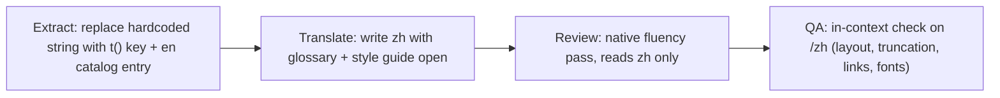

# Internationalization (i18n) — Architecture & Handbook

This document defines how Cosmic Signature becomes a multilingual site, starting with
**Simplified Chinese (`zh`)**. It covers the technical architecture, the message/content
structure, the translation workflow, and the quality bar. It is written so that any
engineer or translator can pick up a sprint from [progress.md](./progress.md) and know
exactly what to do.

**The document set:**

| Document                                 | Purpose                                                                  |
| ---------------------------------------- | ------------------------------------------------------------------------ |
| [README.md](./README.md) (this file)     | Architecture, tooling, workflow, definition of done                      |
| [glossary-zh.md](./glossary-zh.md)       | Canonical Chinese translation for every protocol term + banned-term list |
| [style-guide-zh.md](./style-guide-zh.md) | Rules for making the Chinese sound native, not translated                |
| [progress.md](./progress.md)             | Full site inventory, sprint plan, and live progress tracker              |

> Note: `docs/` is intentionally outside the lexicon scanner's `SCAN_DIRS`
> (see `scripts/lexicon-scan.ts`), so these documents may cite banned vocabulary
> in order to define and forbid it.

---

## 1. Goals and decisions (locked)

- **First target language:** Simplified Chinese, mainland conventions. Locale code `zh`
  (BCP 47 `zh-Hans`; we use the short code in URLs and catalogs).
- **URL strategy:** locale-prefixed paths with `localePrefix: 'as-needed'`.
  English keeps every existing URL unchanged (`/gallery`); Chinese lives under a prefix
  (`/zh/gallery`). This applies on **both hosts**:
  - `cosmicsignature.com/zh` — landing, `cosmicsignature.com/zh/learn/...`
  - `app.cosmicsignature.com/zh/gallery` — dApp
- **Everything is translated.** Every page, tooltip, toast, error, empty state, `aria-label`,
  SEO title/description, OG image text, and JSON-LD. No surface is exempt (admin/internal
  tools are translated last, but they are translated).
- **Quality bar:** the Chinese must read as if originally written in Chinese
  (see [style-guide-zh.md](./style-guide-zh.md)). Literal translation is a defect.
- **Future languages** (zh-Hant, ja, ...) must be addable by: extending `locales`, adding a
  `messages/<locale>/` directory and per-locale content modules, and writing a glossary +
  style guide. No further architectural change.

## 2. Library and routing architecture

**Library: [`next-intl`](https://next-intl.dev)** — the de-facto standard for the App Router.
Reasons: native Server Components support (zero client JS for server-rendered strings),
Next.js 16 compatibility, ICU MessageFormat, typed message keys, built-in locale-aware
navigation APIs, and static rendering support via `setRequestLocale`.

### 2.1 Route restructure

All routes move under a top-level dynamic segment. Route groups are preserved:

```
app/
  [locale]/
    (app)/        ← everything currently in app/(app)/
      layout.tsx
      page.tsx
      gallery/page.tsx
      ...
    (landing)/    ← everything currently in app/(landing)/
      layout.tsx
      landing-site/page.tsx
      ...
  api/            ← API routes stay outside [locale]
```

New i18n plumbing:

```
i18n/
  routing.ts      ← defineRouting({ locales: ['en', 'zh'], defaultLocale: 'en', localePrefix: 'as-needed' })
  request.ts      ← getRequestConfig: loads + merges messages for the request locale
  navigation.ts   ← createNavigation(routing): locale-aware Link, useRouter, usePathname, redirect
messages/
  en/*.json       ← English catalogs (source of truth), one file per namespace
  zh/*.json       ← Chinese catalogs (same keys, same shape)
```

`next.config.ts` gets wrapped with `createNextIntlPlugin()` (composes with the existing
Sentry and bundle-analyzer wrappers).

**Every layout and page** under `[locale]` must:

1. `generateStaticParams()` returning `routing.locales.map((locale) => ({ locale }))`
   (root layouts only), and
2. call `setRequestLocale(locale)` before using any next-intl API — this keeps static
   rendering / CDN caching intact, which the current architecture depends on
   (see the comment in `app/root-document.tsx`).

The locale layout validates the param and provides messages:

```tsx
// app/[locale]/(app)/layout.tsx (same pattern for (landing))
const { locale } = await params;
if (!hasLocale(routing.locales, locale)) notFound();
setRequestLocale(locale);
// <NextIntlClientProvider> wraps providers so client components can translate
```

### 2.2 Navigation codemod

All imports of `next/link`'s `Link` and of `useRouter` / `usePathname` / `redirect` from
`next/navigation` are replaced by the wrappers exported from `i18n/navigation.ts`.
This is what keeps a user on `/zh/...` when they click any internal link. Cross-host links
(`APP_ORIGIN`/`LANDING_ORIGIN` absolute URLs in nav, footer, landing CTAs) must have the
locale prefix appended explicitly — add a helper `localeHref(origin, path, locale)` in
`lib/hostRouting.ts`.

### 2.3 Composing with the host-routing middleware (`proxy.ts`)

The edge middleware currently does host separation (landing vs app) and the
`/` → `/landing-site` rewrite. It gains a locale-awareness layer, in this order:

1. **Split the locale prefix** off the incoming pathname:
   `/zh/gallery` → `{ locale: 'zh', publicPath: '/gallery' }`; `/gallery` → `{ locale: undefined, publicPath: '/gallery' }`.
2. **Run all host checks against `publicPath`** — `isAppOnlyPath`, `isLandingOnlyPath`,
   and the landing root check. Redirect targets re-attach the prefix:
   `${LANDING_ORIGIN}${localePrefix}${publicPath}`.
3. **Landing root rewrite becomes locale-aware:** `/` → `/landing-site`, `/zh` → `/zh/landing-site`.
4. **Delegate to the next-intl middleware** (`createMiddleware(routing)`) instead of
   returning `NextResponse.next()`. It resolves the locale (URL prefix → `NEXT_LOCALE`
   cookie → `Accept-Language` → default), rewrites internally to `/[locale]/...`, and
   manages the cookie.

The middleware `matcher` keeps its current asset exclusions. E2E host-routing specs are
extended with `/zh` variants of every existing case.

### 2.4 Language switcher

A small globe dropdown — options `English` / `中文` — rendered in:

- the dApp header (`components/layout/`), desktop + mobile drawer,
- the landing header and both footers.

Behavior: switching calls `router.replace(pathname, { locale })` from `i18n/navigation.ts`
(preserves the current route and params), and next-intl persists the choice in the
`NEXT_LOCALE` cookie so subsequent visits to unprefixed URLs redirect to the preferred
locale. The switcher itself is labeled in the _target_ language (the Chinese option always
reads 中文, the English option always reads English) — never translate language names.

## 3. Where strings live

Two tiers, chosen by shape of the content:

### 3.1 Message catalogs (`messages/<locale>/*.json`) — UI strings

All interface strings: labels, buttons, table headers, tooltips, toasts, errors, empty
states, aria-labels, form validation, and per-page SEO title/description. One JSON file
per namespace, identical key structure across locales:

```
common.json     nav.json        footer.json     wallet.json
home.json       landing.json    currentCycle.json  gallery.json  detail.json
gesture.json    anchoring.json  allocation.json myPages.json
statistics.json tables.json     tooltips.json   toasts.json
errors.json     forms.json      meta.json       howItWorks.json
siteMap.json    contracts.json  admin.json      formats.json
```

Usage: `useTranslations('gallery')` in client components, `getTranslations` in server
components and `generateMetadata`.

**Key conventions:**

- Keys describe _role_, not content: `hero.headline`, not `everyGestureShapes`.
- Never concatenate translated fragments; use ICU placeholders: `"gestureCost": "Gesture Cost: {amount} ETH"`.
- Chinese has no plural inflection — `plural` blocks in `en` collapse to a single `other`
  form in `zh` (see style guide §7).
- Embedded markup uses `t.rich` with named tags, never raw HTML in messages.
- A string used on 2+ pages goes in `common`/`tables`/`tooltips`, not duplicated.

**Seeding:** `content/dapp.ts` was written as a dApp copy catalog but is not consumed by
production code. Sprint 0 converts it into the initial `messages/en/*.json` files, then
**deletes it** so there is exactly one source of truth. `content/statistics-copy.ts`
migrates into `statistics.json`/`tables.json`/`tooltips.json` during Sprint 5.

### 3.2 Per-locale content modules — long-form structured content

500-line articles don't belong in JSON. Structured long-form copy stays in typed
TypeScript, split per locale with a shared type and a locale accessor:

```
content/
  landing/   types.ts  en.ts  zh.ts  index.ts   ← getLandingContent(locale)
  learn/     types.ts  en.ts  zh.ts  index.ts   ← getLearnContent(locale)
  faq/       types.ts  en.ts  zh.ts  index.ts   ← app/(app)/faq/data/faq-data.ts moves here
  protocol-facts.ts                             ← numbers, locale-independent (unchanged)
```

Legal pages (Terms, Privacy, Risk Disclosures) are markup-heavy TSX; they get per-locale
content components (`TermsContent.en.tsx` / `TermsContent.zh.tsx`) selected by the page on
`params.locale`. Full markup fidelity, no JSON contortions.

**Fallback policy:** `i18n/request.ts` deep-merges `zh` messages over the `en` catalog, so
a missing Chinese key renders English — never a raw key path. Long-form content falls back
at _article granularity_ (a Learn article without a `zh` version serves the English
article under `/zh`). The parity report (§6) tracks every fallback so nothing hides.

## 4. Locale-aware formatting

Current formatting is English-locked and must become locale-aware (mostly Sprint 5):

| Today                                                            | Change                                                                                 |
| ---------------------------------------------------------------- | -------------------------------------------------------------------------------------- |
| `Intl.NumberFormat('en-US')` in `utils/format.ts`, SEO summaries | Take a `locale` argument; use next-intl `useFormatter`/`getFormatter` where convenient |
| `convertTimestampToDateTime` with hardcoded `Jan…Dec`            | `Intl.DateTimeFormat(locale, …)`; zh renders `1月1日 12:34`                            |
| `formatYyyymmddLabel`, `formatUnixTsLabel` month arrays          | Same — `Intl.DateTimeFormat(locale, { month: 'short' })`                               |
| `formatSeconds` → `1d 2h 30m 45s`                                | Locale unit map; zh: `3天5小时12分45秒` (compact contexts), see style guide §5         |
| `formatEthValue`/`formatCSTValue` unit suffixes                  | Units stay `ETH`/`CST` in all locales (glossary: keep-in-English)                      |
| `components/ui/date-picker.tsx` weekday labels `Su…Sa`           | zh: `日 一 二 三 四 五 六`; week starts Monday for zh                                  |
| `react-countdown` renderers                                      | Localized unit labels via `formats.json`                                               |

English output must remain byte-identical — every formatting change is guarded by
existing unit tests plus new zh cases.

## 5. Fonts

Clash Display (display headings) and Inter (body) contain **no CJK glyphs**. Without
action, Chinese renders in unstyled system fallback.

- Add **Noto Sans SC** via `next/font/google` (one variable-weight set,
  `--font-noto-sc`, `display: 'optional'`). Google Fonts serves it as ~100 small
  `unicode-range` slices, so browsers only download the glyph ranges a page actually uses —
  English pages fetch nothing. `optional` prevents a late CJK metric swap on slow links;
  the approved system CJK stack remains visible when Noto misses the short load window.
  Noto is appended to the global font stacks unconditionally (after Inter / after Clash
  Display).
- Chinese headings render in Noto Sans SC via fallback (Clash Display has no CJK). Add an
  `html[lang="zh"]` rule bumping display-heading weight to 700 and tightening
  letter-spacing to `0` (CJK must never be letter-spaced like the Latin display face).
- System fallback chain after Noto: `"PingFang SC", "Microsoft YaHei", sans-serif`.
- `RootDocument` receives `locale` and sets `<html lang={locale}>` — this is also what
  activates the CSS overrides and correct line-breaking behavior.

## 6. SEO, metadata, and structured data

- **`utils/seo.ts` → `createMetadata`** gains a `locale` + `path` requirement and emits:
  - `alternates.canonical` — locale-correct (`/zh/faq` canonicalizes to `/zh/faq`),
  - `alternates.languages` — hreflang map: `en` → unprefixed URL, `zh` → `/zh` URL,
    `x-default` → English,
  - `openGraph.locale` — `en_US` / `zh_CN` (also fix the hardcoded value in
    `app/root-metadata.ts` and the landing layout).
- **Page metadata** moves from inline strings into the `meta` namespace; `generateMetadata`
  reads `params.locale` and calls `getTranslations`. (~59 pages, tracked per-route in
  progress.md.)
- **`app/sitemap.ts` / `lib/seoRoutes.ts`**: every URL entry gains `alternates.languages`.
- **JSON-LD** (`utils/jsonLd.ts`): translated `name`/`description`, `inLanguage: 'zh-Hans'`
  on zh pages; FAQ JSON-LD uses the zh FAQ content.
- **OG images** (`opengraph-image.tsx` files): `ImageResponse` needs an explicit CJK font
  buffer (subset Noto Sans SC TTF in `assets/`) — Latin-only fonts render tofu. Scheduled
  as its own Sprint 7 item.
- **`public/llms.txt`**: add a Chinese section at the end of the rollout.

## 7. Guardrails (CI)

1. **Catalog parity — `scripts/i18n-parity.ts`** (new): compares `messages/en/**` vs
   `messages/zh/**` key sets; reports missing/extra/empty keys per namespace. Runs in CI as
   a _report_ during rollout, flips to _failing_ per-namespace as sprints complete (the
   sprint's acceptance criteria include "parity enforced for its namespaces"). Mixed
   namespaces use a checked-in required-key manifest so later-sprint English extraction can
   land without weakening already-shipped gates; Sprint 1 runs via `yarn i18n:sprint1`.
2. **Chinese lexicon scan**: `scripts/lexicon-scan-core.ts` gains a zh banned-term list
   (from [glossary-zh.md §4](./glossary-zh.md)) applied to `messages/zh/**` and
   `content/**/zh.ts`. Same allow-pragma mechanism for FAQ denial copy.
3. **E2E**: a `zh` smoke spec (home, gallery, learn, FAQ under `/zh`; switcher round-trip;
   cookie persistence; host redirects preserve the prefix). Existing English e2e suites
   run unchanged — they are the regression net proving `en` didn't move.
4. **Unit**: message-loading test asserting every namespace parses and the en fallback
   merge works; formatting tests for zh output.

## 8. Translation workflow (per string, per page)



**Stage definitions (these are the four columns in progress.md):**

- **E — Extracted.** No hardcoded user-facing string remains in the file(s); English
  catalog/content entry exists; English rendering unchanged (spot-check + tests).
- **T — Translated.** zh entry written following the glossary and style guide. Machine
  translation may _draft_, never ship: every string is rewritten by a human who reads the
  glossary first. Interpolations, units, and links verified.
- **R — Reviewed.** A native-fluency editor reads the Chinese **without looking at the
  English** and edits anything that sounds translated (style guide §8 checklist). Glossary
  deviations either fixed or promoted into a glossary change.
- **Q — QA'd.** The page is loaded under `/zh`: no overflow/truncation, correct fonts,
  correct punctuation width, tooltips open with translated content, toasts fire in
  Chinese, links keep the `/zh` prefix, numbers/dates localized, lexicon scan + parity
  green.

**Rules of engagement:**

- Extraction PRs and translation PRs are separate (extraction is mechanical and
  en-reviewable; translation review needs a Chinese reader).
- One glossary. If a translator wants a different term, they change
  [glossary-zh.md](./glossary-zh.md) in the same PR and update all prior uses (grep the
  catalogs) — no silent divergence.
- Commit prefix `i18n(zh): …`; progress.md is updated in the same PR that changes status.
- `protocol-facts.ts` numbers are never restated in prose — interpolate them, exactly as
  the English does.

## 9. Running it locally

```bash
yarn dev
# dApp Chinese:    http://localhost:3000/zh
# landing Chinese: http://cosmicsignature.local:3000/zh   (see lib/hostRouting.ts for /etc/hosts setup)
yarn i18n:strict                       # hard-fail on any en/zh catalog drift
yarn i18n:sprint1 && yarn i18n:sprint2 && yarn i18n:sprint3
yarn i18n:sprint4 && yarn i18n:sprint5 && yarn i18n:sprint6 && yarn i18n:sprint7
yarn terminology:check && yarn lexicon:scan
yarn test:e2e:zh                       # Chinese routes, QA journeys, a11y, routing, wallet
yarn build && yarn bundle:budget       # production output and full app-home JS budget
```

To test locale detection: clear the `NEXT_LOCALE` cookie and set the browser's language to
`zh-CN` — visiting `/` should redirect to `/zh`.

## 10. Adding the next language (later)

1. Add the locale to `i18n/routing.ts`.
2. `cp -r messages/en messages/<locale>` and translate (parity script tracks progress).
3. Add `content/*/<locale>.ts` modules and legal content components.
4. Write `glossary-<locale>.md` + `style-guide-<locale>.md` (for zh-Hant, OpenCC can
   bootstrap from zh-Hans, but terminology and punctuation still need native review).
5. Extend fonts/formats if the script demands it; add the locale to hreflang maps,
   sitemap, parity CI, and e2e smoke.
