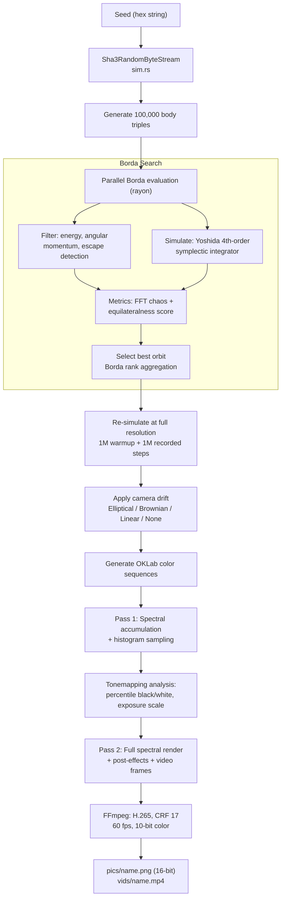

# The Art of Cosmic Signature

## How Every NFT Is Born from Physics

_From a single seed to a one-of-a-kind artwork_

---

## Table of Contents

**Part I -- The Art (For Everyone)**

1. [What You're Looking At](#1-what-youre-looking-at)
2. [From Seed to Art in Seven Stages](#2-from-seed-to-art-in-seven-stages)
3. [Why It Matters](#3-why-it-matters)
4. [What Makes Each Piece Unique](#4-what-makes-each-piece-unique)
5. [Common Questions](#5-common-questions)

**Part II -- The Technical Deep Dive (For the Curious)** 6. [Architecture Overview](#6-architecture-overview) 7. [Seeding and Deterministic RNG](#7-seeding-and-deterministic-rng) 8. [Physics Simulation](#8-physics-simulation) 9. [Orbit Selection: The Borda Search](#9-orbit-selection-the-borda-search) 10. [Camera Drift](#10-camera-drift) 11. [Color Generation](#11-color-generation) 12. [Spectral Rendering Pipeline](#12-spectral-rendering-pipeline) 13. [Tonemapping and Exposure](#13-tonemapping-and-exposure) 14. [Post-Processing Effects](#14-post-processing-effects) 15. [Video Generation](#15-video-generation) 16. [Determinism and Reproducibility](#16-determinism-and-reproducibility) 17. [Technical Reference Tables](#17-technical-reference-tables)

---

# Part I -- The Art

## 1. What You're Looking At

Every Cosmic Signature NFT is a visualization of the **Three Body Problem** -- one of the oldest unsolved problems in physics. Three massive celestial bodies orbit each other under the force of gravity. Unlike two bodies (which trace neat ellipses), three bodies produce trajectories that are fundamentally unpredictable. Tiny differences in starting conditions lead to wildly different paths. The result is **deterministic chaos**: not random, but impossible to forecast.

The artwork captures this dance. Each of the three bodies leaves a trail of spectral light as it moves through space. These trails are not painted -- they are **physically simulated** using real Newtonian gravity and a high-precision numerical integrator (a physics calculator specifically designed to conserve energy perfectly over millions of steps) borrowed from astrophysics research. The colors span the visible light spectrum from deep violet (380 nm) to vivid red (700 nm), rendered using the same physics that describes how real light behaves.

The result is an image and a 30-second video that are unique to each NFT's on-chain seed. No two seeds produce the same art. No AI is involved. No human hand touches the output. It is pure physics, rendered in light.

### What Does It Actually Look Like?

Imagine three stars caught in each other's gravity, endlessly circling and swerving past one another. Now imagine they leave behind glowing trails of colored light as they move. Over a million moments of this gravitational dance, those trails weave together into dense, luminous tangles -- sometimes tightly wound spirals, sometimes loose, billowing arcs that fill the frame. The colors are not static: they flow continuously through the visible spectrum, shifting from deep violet through electric blue and emerald green to warm gold and vivid red. Where the bodies whip past each other at high speed, the trails compress into razor-thin filaments of intense brightness. Where they slow and linger, the trails spread into soft, diffuse clouds.

Some pieces feature a faint cosmic nebula glowing behind the orbital trails -- swirling clouds of color generated from fractal noise, giving the artwork a sense of depth, as if the viewer is looking into deep space. The camera itself may slowly orbit the scene, revealing the three-dimensional structure of the trajectories as the viewpoint drifts.

The final result has the color depth and dynamic range of professional cinema -- rich blacks, luminous highlights, and subtle gradations that reward close inspection.

## 2. From Seed to Art in Seven Stages

Every Cosmic Signature artwork follows the same pipeline. A hex seed (derived from on-chain randomness when the NFT is minted) drives the entire process:

### Stage 1: The Seed

A hex string (like `0x46205528`) is fed into a SHA3-256 cryptographic hash function -- a mathematical one-way scrambler that turns any input into a fixed-size fingerprint. This produces a deterministic stream of random numbers -- billions of them, all perfectly reproducible from the same seed.

### Stage 2: The Search

The system generates **100,000 random three-body configurations** -- each with different masses, positions, and velocities for the three bodies. Every configuration is simulated forward in time using real gravitational physics. Most orbits are boring: one body escapes, the triangle collapses, or the motion is too simple. A scoring system evaluates each orbit on two criteria -- how complex the motion is and how balanced the triangle shape remains -- then selects the single most visually interesting orbit.

### Stage 3: The Simulation

The winning configuration is simulated again at full resolution: **one million timesteps** of gravitational physics. The first million steps serve as a warmup (letting the orbit develop its character), and the next million steps are recorded. At each step, the position of every body in 3D space is stored.

### Stage 4: The Camera

An optional camera drift is applied to the recorded trajectory. By default, the viewpoint traces a slow elliptical orbit around the scene, giving the video a cinematic quality -- as if the viewer is circling the gravitational dance from a distance.

### Stage 5: The Colors

Each of the three bodies is assigned a base color in the OKLab perceptual color space, with 120 degrees of hue separation between them. The colors evolve over time through slow hue drift, sine-wave modulation, and subtle jitter -- so the trails shift from violet to blue to cyan to green and beyond as the simulation progresses.

### Stage 6: The Rendering

This is where the physics becomes light. Every timestep, the three bodies form a triangle. The three edges of that triangle are drawn as anti-aliased line segments onto the image canvas. But instead of drawing simple colors, the renderer works in the **spectral domain** (working with individual wavelengths of light instead of just red, green, and blue): each pixel holds 16 wavelength bins spanning the visible spectrum (380--700 nm). The color of each body is converted to a dominant wavelength, and energy is deposited into the appropriate spectral bins with fractional interpolation. Line thickness varies with velocity -- fast-moving bodies leave thinner, more intense trails. Depth of field blurs distant elements. The result, after one million timesteps of accumulation, is a rich spectral energy map for every pixel.

### Stage 7: The Finish

The spectral data is converted to visible color through a physically-motivated process. A two-pass histogram analysis determines optimal exposure. An AgX-style tonemapping curve -- like a camera's automatic exposure control, adjusting brightness so that details aren't washed out in bright areas or lost in shadows -- maps the high dynamic range data to displayable values. Then a curated chain of post-effects is applied -- bloom, glow, chromatic dispersion, nebula cloud overlays (generated from OpenSimplex noise), cinematic color grading, and more. The final output is a **16-bit PNG** (for maximum color fidelity) and a **30-second H.265 video at 60 fps**.

## 3. Why It Matters

**Deterministic.** The same seed always produces the exact same image and video, down to every pixel. This is verified by automated CI tests that compare SHA-256 hashes of output images across builds. Your NFT's art is not just unique -- it is _provably_ tied to its on-chain seed.

**Physics-based.** The art emerges from real gravitational simulation, not from AI models, random noise, or hand-drawn assets. The unpredictable beauty of the Three Body Problem is the artist.

**No AI.** There are no neural networks, no diffusion models, no training data. The entire pipeline is deterministic numerical computation: gravity, Fourier analysis, spectral optics, and signal processing.

**Spectral.** Most generative art works in RGB (red, green, blue). Cosmic Signature works in the spectral domain -- 16 bins covering the full visible light spectrum. This produces color transitions and mixing behaviors that are impossible to achieve with standard RGB rendering.

**Museum-quality.** 16-bit color depth, 4K-capable resolution, H.265 video with 10-bit color. The rendering pipeline includes techniques borrowed from professional film post-production: AgX tonemapping, chromatic dispersion, velocity-dependent HDR, and perceptual color grading.

## 4. What Makes Each Piece Unique

Every seed produces different:

- **Masses** for each body (100--300 units) -- heavier bodies create tighter, more intense orbits
- **Starting positions** -- the initial arrangement of the triangle in 3D space
- **Starting velocities** -- small velocity differences lead to dramatically different trajectories over time
- **Color palettes** -- base hue, wave frequency, and per-body phase offsets are all seed-derived
- **Post-processing effects** -- many visual effects (bloom strength, nebula density, grading intensity) are randomized per-seed from curated distributions
- **Camera drift** -- the orbital parameters of the camera's slow sweep around the scene

The Borda selection process means the system always chooses its best candidate from 100,000 options. Every piece is visually interesting, but no two are alike.

## 5. Common Questions

**Can two NFTs ever look the same?**
No. Each NFT's on-chain seed produces a completely unique stream of random numbers through SHA3-256 cryptographic hashing. Even seeds that differ by a single bit generate entirely different orbits, colors, and effects. The chance of two seeds producing visually similar art is astronomically small -- comparable to two people independently shuffling a deck of cards into the same order.

**Is any AI involved?**
None whatsoever. There are no neural networks, no diffusion models, no training data, and no machine learning of any kind. The entire pipeline is deterministic numerical computation: gravity equations, Fourier analysis, spectral optics, and signal processing. The art emerges from physics, not from pattern recognition.

**How long does it take to generate one NFT?**
At default settings (1920x1080 resolution, 100,000 orbit candidates, 1 million simulation steps), generation takes approximately 3--8 minutes on a modern multi-core CPU. The Borda search (evaluating 100,000 orbits in parallel) is the most compute-intensive stage. Video encoding adds roughly 30--60 seconds depending on hardware.

**Can I regenerate my NFT's art myself?**
Yes. The entire codebase is open source under CC0 1.0 (public domain). If you know your NFT's seed, you can clone the repository, build the Rust binary, run it with your seed, and produce a pixel-identical copy of your artwork. Automated CI tests verify this reproducibility on every build.

**What makes this different from other generative art?**
Most generative art works in RGB color space with 2D algorithms. Cosmic Signature simulates real 3D gravitational physics and renders in the spectral domain -- 16 wavelength bins covering the full visible light spectrum. The post-production pipeline borrows techniques from professional film: AgX tonemapping, chromatic dispersion, and 10-bit HDR video encoding.

---

# Part II -- The Technical Deep Dive

_This section documents the complete rendering pipeline with references to source code and exact constants. All code is open-source under CC0 1.0._

## 6. Architecture Overview

The system is implemented as a single Rust binary (`three_body_problem`) with no runtime dependencies beyond FFmpeg (for video encoding). The codebase is tuned for release builds with LTO, single codegen unit, `panic = abort`, and native CPU flags (AVX2 + FMA on x86_64).



## 7. Seeding and Deterministic RNG

**Source**: `src/sim.rs`, `Sha3RandomByteStream`

The RNG is built on SHA3-256 (Keccak). Given an initial seed (arbitrary bytes), it produces an infinite deterministic byte stream:

1. Initialize: `hasher.update(seed)`, `buffer = hasher.finalize_reset()`
2. Extend: when the 32-byte buffer is exhausted, `hasher.update(seed); hasher.update(buffer); buffer = hasher.finalize_reset()`
3. `next_f64()` = `next_u64() as f64 / u64::MAX as f64` -- uniform in [0, 1)

This stream drives all randomness in the pipeline: body masses, positions, velocities, color generation, effect randomization, drift parameters.

**Why SHA3?** Cryptographic hash functions provide excellent statistical properties (no detectable patterns, full avalanche effect) and are standardized. A single bit change in the seed produces a completely different output stream.

## 8. Physics Simulation

**Source**: `src/sim.rs`

### Gravitational Model

Classical Newtonian pairwise gravity with gravitational constant G = 9.8:

```
a_i = -G * sum_{j != i} m_j * (r_i - r_j) / |r_i - r_j|^3
```

Each body has mass (scalar), position (3D vector), velocity (3D vector), and acceleration (3D vector). All simulation is in 3D, though the rendering projects to 2D.

### Centre-of-Mass Frame

Before integration, `shift_bodies_to_com()` translates all bodies so the total centre of mass is at the origin and total linear momentum is zero. This removes translational drift and ensures the system is bound.

### Yoshida 4th-Order Symplectic Integrator

The integrator is a 4th-order Yoshida scheme -- a symplectic method specifically designed for Hamiltonian systems like gravitational N-body problems:

```
W1 = 1.3512071919596578
W0 = -1.7024143839193153

C1 = W1 / 2,  C2 = (W0 + W1) / 2,  C3 = C2,  C4 = C1
D1 = W1,      D2 = W0,              D3 = W1
```

Each timestep (dt = 0.001) applies four position kicks and three velocity kicks in alternation:

```
for each of 4 substeps:
    position += velocity * C_k * dt
    (recompute accelerations)
    velocity += acceleration * D_k * dt
```

**Why symplectic?** Unlike Runge-Kutta or Euler methods, symplectic integrators preserve the geometric structure of Hamiltonian mechanics. They do not artificially gain or lose energy over millions of timesteps. This is critical for producing physically plausible long-duration orbits that remain visually coherent.

### Trajectory Recording

The winning orbit is simulated in two phases:

1. **Warmup**: 1,000,000 steps of integration without recording (allows chaotic dynamics to develop)
2. **Recording**: another 1,000,000 steps, with positions stored at each step

Total simulated time: 2,000,000 \* dt = 2,000 time units.

## 9. Orbit Selection: The Borda Search

**Source**: `src/sim.rs` (`select_best_trajectory`), `src/analysis.rs`

From 100,000 random initial conditions, the system must select the single most visually interesting orbit. This is a multi-objective optimization problem solved via Borda count rank aggregation.

### Step 1: Generation

100,000 triples of bodies are generated from the RNG. Each body gets:

- Mass: uniform in [100, 300]
- Position: uniform in [-300, 300] per axis
- Velocity: uniform in [-1, 1] per axis

Each triple is shifted to the centre-of-mass frame.

### Step 2: Fast Rejection

Candidates are evaluated in parallel using `rayon`. Quick filters discard clearly unsuitable orbits:

- **Energy filter**: total energy > 10 (unbound system) -- discard
- **Angular momentum filter**: |L| < 10 (degenerate configuration) -- discard
- **Escape detection**: during simulation, every 10,000 steps, check if any body's kinetic energy exceeds its gravitational binding energy by more than -0.3 (the escape threshold). If so, discard.

### Step 3: Quality Metrics

Two metrics are computed for surviving candidates:

**Non-chaoticness** (`analysis.rs`): For each body, compute the distance to the centre of mass of the other two bodies over time. Apply a Fast Fourier Transform (FFT) to this distance signal. Take the standard deviation of the magnitude spectrum. Average across all three bodies. Higher values indicate more regular (less chaotic) orbits. Very chaotic orbits have flat, spread-out frequency spectra; regular orbits have concentrated spectral peaks.

**Equilateralness** (`analysis.rs`): At each timestep, compute the three side lengths of the triangle formed by the three bodies. Score = mean of (min_side / max_side) over all timesteps. A perfect equilateral triangle scores 1.0; a degenerate line scores near 0. This metric favors orbits where the three bodies maintain a balanced triangular arrangement.

### Step 4: Borda Aggregation

All surviving candidates are ranked independently on each metric:

- Non-chaoticness: ascending sort (lowest values -- the most chaotic orbits -- receive the highest points)
- Equilateralness: descending sort (most equilateral = highest points)

The ranking is implemented by the `assign()` function in `sim.rs`:

```
fn assign(values, high_is_better):
    if high_is_better:
        sort values descending   # largest first
    else:
        sort values ascending    # smallest first
    for each (rank, value) in sorted order:
        points[original_index] = N - rank
```

For non-chaoticness, `high_is_better = false` (ascending sort), so the smallest values -- the most chaotic orbits -- land at rank 0 and receive N points (the maximum). For equilateralness, `high_is_better = true` (descending sort), so the most equilateral orbits receive the most points.

The final weighted score combines both:

```
score = 0.75 * chaos_points + 11.0 * equilateralness_points
```

The equilateralness weight (11.0) dominates the chaos weight (0.75) by a factor of ~15x. This strongly favors orbits that form balanced, visually pleasing triangles. The chaos term rewards complex, unpredictable motion -- among equally balanced orbits, the most chaotic (and therefore most visually intricate) trajectory wins.

The candidate with the highest weighted score is selected.

## 10. Camera Drift

**Source**: `src/drift.rs`, `src/drift_config.rs`

After the orbit is recorded, a camera motion transform is applied to all positions. This creates a slow parallax effect in the final video.

| Mode                     | Description                                                                                                                                                                                                                                  |
| ------------------------ | -------------------------------------------------------------------------------------------------------------------------------------------------------------------------------------------------------------------------------------------- |
| **Elliptical** (default) | The viewpoint traces an elliptical orbit with configurable scale, arc fraction (how much of the ellipse to traverse), and eccentricity (0 = circle, 0.95 = highly elongated). Parameters are randomized per-seed from curated distributions. |
| **Brownian**             | Random walk using Box-Muller Gaussian displacements at each timestep. Produces organic, wandering camera motion.                                                                                                                             |
| **Linear**               | Constant-velocity camera translation. Produces a slow pan.                                                                                                                                                                                   |
| **None**                 | Fixed camera.                                                                                                                                                                                                                                |

Drift parameters (scale, arc fraction, eccentricity) are resolved by `resolve_drift_config` from the RNG when not explicitly specified on the command line.

## 11. Color Generation

**Source**: `src/render/color.rs`, `src/render/constants.rs`

Colors are generated in OKLab (Oklab) -- a perceptually uniform color space designed by Bjorn Ottosson. Unlike sRGB, equal numerical distances in OKLab correspond to equal perceived color differences.

### Per-Body Color Sequences

Each of the three bodies receives a color sequence of length `steps`:

1. **Base hue**: random offset from RNG + `body_index * 120` degrees + fixed phase offsets [0, 120, 240]. This ensures the three bodies start with maximally separated hues.
2. **Hue wave frequency**: randomized per-seed in [1.8, 4.0] -- controls how fast colors cycle.
3. **Per-step hue**: `base_hue + BASE_HUE_DRIFT * (1 + ln(step)) * HUE_DRIFT_SCALE + sin(wave_freq * t) * HUE_WAVE_AMPLITUDE ± jitter`, which expands to `base_hue + 1.4 * (1 + ln(step)) * 1.85 + sin(wave_freq * t) * 52 ± 0.1`
4. **Chroma**: base 0.22 + random variation 0.14 + wave modulation 0.10 (with chroma boost enabled)
5. **Lightness**: base 0.62 + random variation 0.32 + wave modulation 0.28, clamped to [0, 1]
6. **Convert**: OKLCh (cylindrical) to OKLab (Cartesian): `a = chroma * cos(hue)`, `b = chroma * sin(hue)`

### Per-Body Alpha

With alpha variation enabled (default), each body is assigned a different opacity from the set {1/13M, 1/15M, 1/17M}, shuffled randomly. This creates a subtle depth hierarchy -- one body's trails appear slightly brighter than the others.

## 12. Spectral Rendering Pipeline

**Source**: `src/render/drawing.rs`, `src/spectrum.rs`, `src/spectral_constants.rs`, `src/render/mod.rs`

This is the core visual algorithm that distinguishes Cosmic Signature from conventional generative art.

### Spectral Accumulation Buffer

Instead of RGB, each pixel stores an array of 16 energy values -- one per wavelength bin spanning the visible spectrum:

| Bin | Wavelength Range | Approximate Color |
| --- | ---------------- | ----------------- |
| 0   | 380--400 nm      | Deep violet       |
| 1   | 400--420 nm      | Violet            |
| 2   | 420--440 nm      | Blue-violet       |
| 3   | 440--460 nm      | Blue              |
| 4   | 460--480 nm      | Cyan-blue         |
| 5   | 480--500 nm      | Cyan              |
| 6   | 500--520 nm      | Cyan-green        |
| 7   | 520--540 nm      | Green             |
| 8   | 540--560 nm      | Yellow-green      |
| 9   | 560--580 nm      | Yellow            |
| 10  | 580--600 nm      | Orange-yellow     |
| 11  | 600--620 nm      | Orange            |
| 12  | 620--640 nm      | Red-orange        |
| 13  | 640--660 nm      | Red               |
| 14  | 660--680 nm      | Deep red          |
| 15  | 680--700 nm      | Far red           |

Bin width = (700 - 380) / 16 = 20 nm per bin.

### Drawing Lines

At each timestep, the three bodies form a triangle. Three edges are drawn as anti-aliased line segments:

1. **Hue to wavelength**: Each body's OKLab `(a, b)` values are converted to a dominant wavelength via `oklab_hue_to_wavelength()` -- a piecewise mapping that aligns OKLab hue angles to their corresponding physical wavelengths.

2. **Fractional bin interpolation**: The wavelength maps to a fractional bin position: `bin_f = (wavelength - 380) / 20`. Energy is split between the two adjacent bins: `bin_left += energy * (1 - frac)`, `bin_right += energy * frac`. This prevents aliasing between spectral channels.

3. **Anti-aliased drawing**: For each pixel near the line segment, energy is deposited with a Gaussian falloff based on perpendicular distance:

```
energy = alpha * hdr_scale * exp(-distance^2 / sigma^2) * depth_fade
```

4. **Velocity-dependent thickness**: The line's effective sigma (width) scales inversely with the segment's screen-space velocity. Fast-moving bodies leave thin, bright streaks; slow-moving bodies leave wider, softer trails.

5. **Depth of field**: Line thickness is additionally modulated by the body's z-coordinate (depth). Bodies farther from the camera plane produce wider, softer lines -- simulating a real lens's circle of confusion.

6. **Depth fade**: An exponential attenuation `exp(-|z| * 0.002)` dims bodies that are farther away.

7. **Velocity HDR**: A `VelocityHdrCalculator` boosts energy deposition at high velocities (threshold: 0.15 normalized units, boost factor up to 8x). This creates dramatic flares at moments of close gravitational encounter.

### Energy Density Shift

After accumulation, pixels with high total spectral energy undergo a **red-shift**: energy is redistributed from shorter-wavelength bins toward longer-wavelength (redder) bins. This simulates a "heat glow" effect in regions of intense orbital activity. The threshold is 0.08 normalized energy; shift strength is 0.75 per density unit.

### SPD to RGB Conversion

The 16-bin spectral power distribution is converted to linear RGB using a Bruton-style wavelength-to-RGB basis function, combined with per-bin tone weights stored in `BIN_COMBINED_LUT`. An optional radial chromatic dispersion step samples neighboring pixels' spectral data with a wavelength-dependent spatial offset (like a prism), producing rainbow-fringed trails near the image edges.

### Parallelism

Spectral accumulation is parallelized across image rows using `rayon`. The accumulation buffer is partitioned into row-aligned chunks, eliminating the need for locks. SIMD-accelerated paths (`spectrum_simd.rs`) handle the SPD-to-RGB conversion on supported platforms.

## 13. Tonemapping and Exposure

**Source**: `src/render/histogram.rs`, `src/render/mod.rs`

The spectral accumulation produces a high dynamic range (HDR) linear image. This must be mapped to displayable values through tonemapping.

### Two-Pass Architecture

**Pass 1 (Histogram)**: Samples 240 evenly-spaced frames from the trajectory. For each sample frame, the system performs full spectral accumulation, SPD-to-RGB conversion, and post-effects (at full resolution). The resulting premultiplied RGB values are collected into a `HistogramData` structure.

**Exposure Analysis**: The histogram is sorted per-channel. Percentile-based black and white points are extracted (configurable `clip_black` and `clip_white`). An exposure scale is computed to map the white percentile to a target luminance (0.88 default), with a highlight budget governor that darkens exposure if too many samples exceed 1.10 normalized luminance.

**Pass 2 (Full Render)**: Using the computed black/white/exposure levels, all 1,800 video frames are rendered at full quality.

### AgX-Style Tonemapping

The tonemapper applies a sigmoid-like curve inspired by AgX (the modern replacement for ACES in many film pipelines):

1. **Premultiply** by exposure scale
2. **Linear stretch** from black to white point
3. **Log-domain transform** with matrix color rotation
4. **Spline curve** with configurable paper white (0.92) and highlight rolloff (2.25)
5. **Matrix inverse** back to display RGB
6. **Highlight shoulder compression** to prevent hard clipping

### Punchy Mode (ACES_TWEAK_ENABLED)

The tonemapper supports two output matrix variants, selected by the `ACES_TWEAK_ENABLED` flag (default: `true`):

- **AgX Punchy Outset** (enabled by default): Uses a higher-contrast 3x3 matrix that pushes saturation and tonal separation further. The diagonal coefficients (1.133, 1.148, 1.040) are larger than the default, amplifying channel separation for more vivid results. This mode was tuned specifically for generative art where the input is spectral accumulation rather than photographic data.
- **AgX Default Outset**: A more conservative matrix (diagonals 1.099, 1.111, 1.030) that produces flatter, more photographic output.

Both modes feed into the same highlight shoulder compression stage (`compress_display_highlights`), which uses the paper white (0.92) and rolloff (2.25) parameters to smoothly roll off luminance above the target white point.

### Computational Profile

Approximate wall-clock times at default settings (1920x1080, 100K sims, 1M steps) on a modern 8-core CPU:

| Stage                         | Time          | Parallelized                     |
| ----------------------------- | ------------- | -------------------------------- |
| Borda search (100K orbits)    | ~2--5 min     | Yes (rayon, all cores)           |
| Full simulation (2M steps)    | ~5 sec        | No (sequential integrator)       |
| Pass 1 histogram (240 frames) | ~15--30 sec   | Yes (row-parallel rendering)     |
| Pass 2 video (1,800 frames)   | ~1--3 min     | Yes (row-parallel rendering)     |
| FFmpeg encoding               | ~30--60 sec   | Yes (internal encoder threading) |
| **Total**                     | **~3--8 min** |                                  |

Memory usage is dominated by the spectral accumulation buffer: `width * height * 16 bins * 8 bytes` = ~237 MB at 1080p. The trajectory storage (3 bodies _ 1M steps _ 3D vectors) adds ~69 MB.

## 14. Post-Processing Effects

**Source**: `src/render/effects.rs`, `src/post_effects/`

A configurable chain of post-effects is applied after spectral-to-RGB conversion but before tonemapping. Each effect can be independently enabled/disabled and has parameters that are either explicitly set or randomized per-seed from curated distributions.

| Effect                | Description                                                                                                                                                 |
| --------------------- | ----------------------------------------------------------------------------------------------------------------------------------------------------------- |
| **Gaussian Bloom**    | Extracts highlights above a threshold, applies Gaussian blur, adds back to the image for a soft glow around bright regions.                                 |
| **DoG Bloom**         | Difference-of-Gaussians bloom with configurable sigma ratio and strength. More controlled than simple Gaussian bloom.                                       |
| **Glow**              | Broad-radius light diffusion for an ethereal atmosphere.                                                                                                    |
| **Chromatic Bloom**   | Bloom applied per-channel with slight offsets, producing subtle color fringing in bright areas.                                                             |
| **Perceptual Blur**   | Gaussian blur performed in OKLab space (perceptually uniform), preventing the hue shifts that occur with RGB-space blurring.                                |
| **Micro-Contrast**    | High-frequency detail enhancement. Sharpens fine trail structures without affecting overall tonal balance.                                                  |
| **Gradient Map**      | Maps luminance to a configurable color gradient for artistic palette control.                                                                               |
| **Cinematic Grade**   | Full color grading suite: vibrance, clarity, tone curve, shadow/highlight tinting, vignette. Default shadow tint is cool blue; highlight tint is warm gold. |
| **Opalescence**       | Iridescent color shifting based on surface orientation and angle -- produces pearlescent shimmer.                                                           |
| **Champleve**         | Metal-inlay-inspired effect with cell-based interference patterns, rim highlights, and anisotropic brushed-metal sheen.                                     |
| **Aether**            | Volumetric scattering simulation with filament density, flow alignment, and caustic patterns in negative space.                                             |
| **Edge Luminance**    | Brightens edges where trails meet dark background, enhancing definition.                                                                                    |
| **Atmospheric Depth** | Distance-based color desaturation and haze, simulating atmospheric perspective.                                                                             |
| **Fine Texture**      | Subtle noise-based texture overlay applied after tonemapping for organic grain.                                                                             |

### Nebula Clouds

**Source**: `src/render/nebula_clouds.rs`

When enabled, a nebula layer is composited beneath the orbital trails. The nebula is generated using **multi-octave OpenSimplex2S noise** (fBm-style fractal Brownian motion) with configurable lacunarity and persistence. The noise field is colored using the scene's palette and blended with the background.

### Effect Randomization

**Source**: `src/render/randomizable_config.rs`

`RandomizableEffectConfig` holds `Option<T>` for each parameter. When a parameter is `None`, it is drawn from a curated distribution by the RNG. When `Some(value)`, it is used as-is. After resolution, a `RandomizationLog` records which parameters were randomized and their resolved values -- this is stored in `generation_log.json` for full reproducibility.

## 15. Video Generation

**Source**: `src/render/video.rs`, `src/render/constants.rs`

| Parameter      | Value                                          |
| -------------- | ---------------------------------------------- |
| Frame rate     | 60 fps                                         |
| Target frames  | 1,800 (~30 seconds)                            |
| Frame interval | steps / 1800 (min 1)                           |
| Codec          | H.265 (libx265)                                |
| CRF            | 17 (near-lossless)                             |
| Pixel format   | yuv422p10le (10-bit 4:2:2)                     |
| Preset         | slower                                         |
| Tune           | grain                                          |
| Color metadata | BT.709                                         |
| Input format   | Raw rgb48le (16-bit RGB) piped to FFmpeg stdin |

The renderer streams raw 16-bit frames directly to an FFmpeg subprocess via stdin, avoiding disk I/O for intermediate frames. Temporal smoothing (blend factor 0.10) is optionally applied between consecutive frames for smoother video.

A fast-encode mode is available: on macOS it uses `hevc_videotoolbox` (hardware encoder); on Linux it falls back to `libx264` with faster settings.

The final video frame is also saved as a 16-bit PNG for the still image output.

## 16. Determinism and Reproducibility

Every aspect of the pipeline is deterministic given the same seed:

- **RNG**: SHA3-256 chaining is platform-independent and produces identical output for identical input
- **Physics**: Symplectic integrator with IEEE 754 double-precision arithmetic
- **Rendering**: Accumulation order is fixed; parallel row partitioning produces identical results to serial execution (verified by unit tests comparing parallel and serial reference implementations)
- **Effects**: All randomized parameters are logged in `generation_log.json` with their resolved values
- **CI verification**: `ci/verify_reference.py` compares SHA-256 hashes of rendered images against known baselines

This means: if you know an NFT's seed, you can rebuild its exact artwork from source. The code is CC0 1.0 -- anyone can verify this independently.

## 17. Technical Reference Tables

### Simulation Parameters

| Parameter               | Default     | Description                                    |
| ----------------------- | ----------- | ---------------------------------------------- |
| `sims`                  | 100,000     | Borda candidates per generation                |
| `steps`                 | 1,000,000   | Integration steps per orbit                    |
| `dt`                    | 0.001       | Timestep for integrator                        |
| `G`                     | 9.8         | Gravitational constant                         |
| Mass range              | [100, 300]  | Per-body mass (uniform)                        |
| Position range          | [-300, 300] | Per-axis initial position                      |
| Velocity range          | [-1, 1]     | Per-axis initial velocity                      |
| Chaos weight            | 0.75        | Borda weight for non-chaoticness               |
| Equil weight            | 11.0        | Borda weight for equilateralness               |
| Escape threshold        | -0.3        | Per-body energy threshold for escape detection |
| Energy filter           | > 10        | Discard unbound systems                        |
| Angular momentum filter | < 10        | Discard degenerate configurations              |

### Rendering Parameters

| Parameter              | Default    | Description                           |
| ---------------------- | ---------- | ------------------------------------- |
| Resolution             | 1920x1080  | Output dimensions                     |
| Spectral bins          | 16         | Wavelength bins (380--700 nm)         |
| Bin width              | 20 nm      | Per-bin spectral range                |
| Alpha denominator      | 15,000,000 | Base body opacity = 1/15M             |
| Alpha compress         | 6.0        | Alpha compression factor              |
| HDR boost factor       | 8.0        | Maximum velocity-based brightness     |
| HDR boost threshold    | 0.15       | Velocity above which HDR activates    |
| Energy shift threshold | 0.08       | Above this, spectral red-shift occurs |
| Energy shift strength  | 0.75       | Red-shift intensity factor            |
| Paper white            | 0.92       | Tonemapping target luminance          |
| Highlight rolloff      | 2.25       | Shoulder compression strength         |

### Color Parameters

| Parameter              | Default     | Description             |
| ---------------------- | ----------- | ----------------------- |
| Hue separation         | 120 degrees | Between adjacent bodies |
| Hue wave amplitude     | 52 degrees  | Palette sway range      |
| Hue drift scale        | 1.85        | Rate of hue evolution   |
| Hue wave frequency     | [1.8, 4.0]  | Per-seed randomized     |
| Chroma base (boosted)  | 0.22        | OKLab chroma center     |
| Chroma range (boosted) | 0.14        | Chroma variation        |
| Lightness base         | 0.62        | OKLab lightness center  |
| Lightness range        | 0.32        | Lightness variation     |

### Source File Map

| File                                | Role                                                    |
| ----------------------------------- | ------------------------------------------------------- |
| `src/main.rs`                       | CLI entry point, configuration, pipeline orchestration  |
| `src/app.rs`                        | Application workflow functions                          |
| `src/sim.rs`                        | SHA3 RNG, Body struct, Yoshida integrator, Borda search |
| `src/analysis.rs`                   | FFT-based chaos metric, equilateralness score           |
| `src/drift.rs`                      | Camera drift modes (elliptical, brownian, linear)       |
| `src/render/color.rs`               | OKLab color generation                                  |
| `src/render/drawing.rs`             | Anti-aliased spectral line drawing                      |
| `src/render/mod.rs`                 | Render orchestration, tonemapping, frame generation     |
| `src/render/effects.rs`             | Post-processing effect chain                            |
| `src/render/histogram.rs`           | Histogram analysis and exposure computation             |
| `src/render/video.rs`               | FFmpeg integration and video encoding                   |
| `src/render/nebula_clouds.rs`       | OpenSimplex noise nebula generation                     |
| `src/spectrum.rs`                   | SPD-to-RGB conversion, wavelength-to-color basis        |
| `src/spectral_constants.rs`         | Spectral bin boundaries and conversion functions        |
| `src/spectrum_simd.rs`              | SIMD-accelerated spectral conversion                    |
| `src/render/randomizable_config.rs` | Effect parameter randomization                          |
| `src/generation_log.rs`             | Reproducibility logging                                 |

---

_The complete source code is released under CC0 1.0 Universal (public domain) and is available on GitHub for independent review and verification._

_cosmicsignature.com | cosmicsignature.art_
